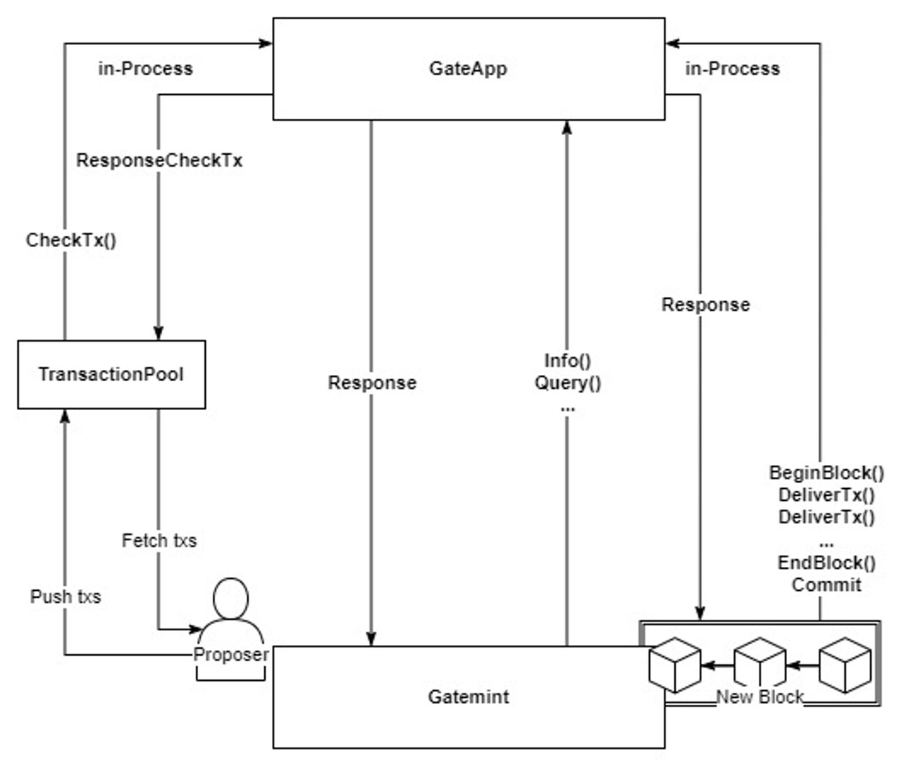

# Transactions and Block Architecture

A transaction in GateChain represents a fundamental operation that triggers state changes in the blockchain. Understanding the transaction and block architecture is crucial for developers working with GateChain.

## Transaction Flow

### 1. Transaction Creation and Propagation
- Users create and sign transactions using their private keys
- Signed transactions are propagated to the GateChain network
- Each transaction contains essential information such as sender, recipient, value, and data

### 2. Transaction Pool (Mempool)
- Unconfirmed transactions are stored in the mempool
- Validators select transactions from the mempool based on:
  - Gas price priority
  - Transaction nonce
  - Account balance validation

### 3. Block Creation
- Validators create new blocks by:
  - Selecting transactions from the mempool
  - Validating transaction signatures
  - Executing transaction operations
  - Updating the state

### 4. Block Validation and Consensus
- New blocks go through consensus mechanism
- Other validators verify:
  - Block hash
  - Transaction signatures
  - State transitions
  - Consensus rules

### 5. Block Finalization
- Once consensus is reached:
  - Block is added to the chain
  - State is updated
  - Transactions are marked as confirmed

## Block Structure

### Block Header
- Previous block hash
- Timestamp
- Block height
- State root
- Transaction root
- Consensus-related data

### Block Body
- List of transactions
- Transaction receipts
- Execution results

## Transaction Types

1. **Value Transfer**
   - Standard token transfers
   - Native token (GT) transfers

2. **Smart Contract Operations**
   - Contract deployment
   - Contract method calls
   - State modifications

3. **System Operations**
   - Validator operations
   - Governance proposals
   - Parameter updates

## Transaction Lifecycle

1. **Creation**
   - Transaction signing
   - Parameter setting
   - Gas estimation

2. **Validation**
   - Signature verification
   - Balance checks
   - Nonce validation

3. **Execution**
   - State changes
   - Event emission
   - Result recording

4. **Finalization**
   - Receipt generation
   - State commitment
   - Block inclusion

