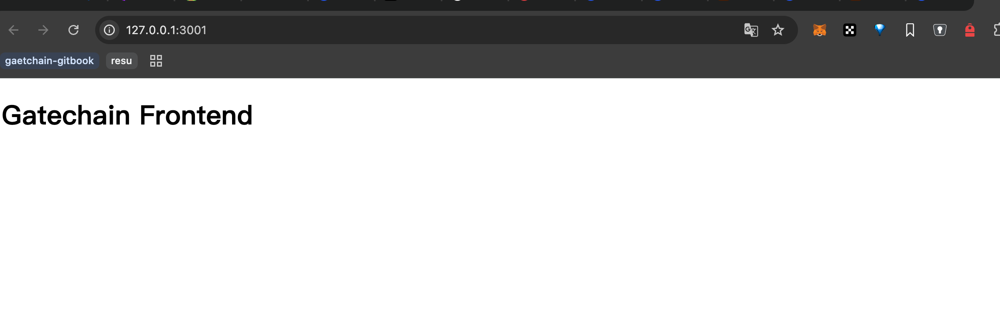
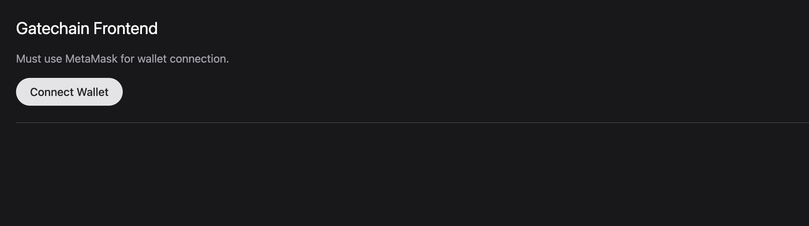
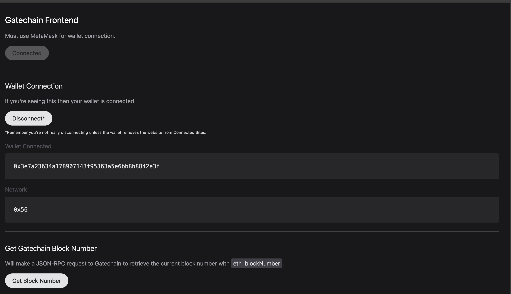
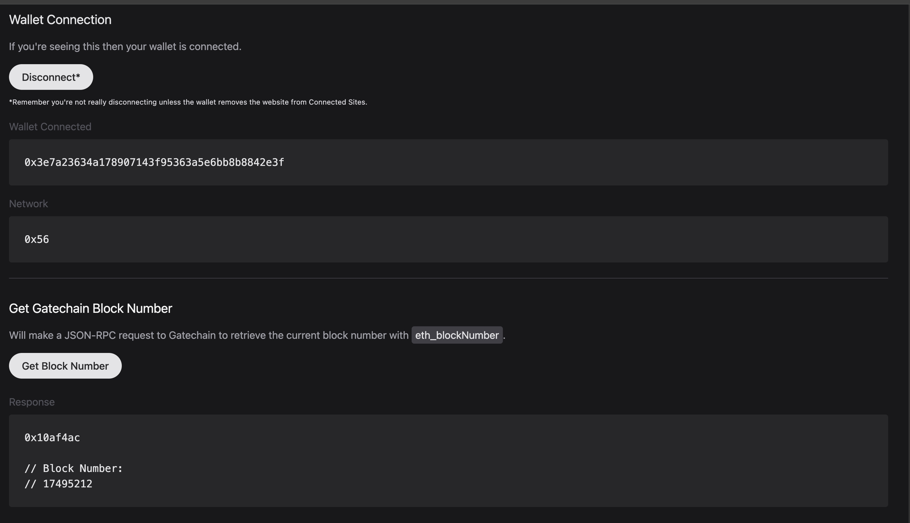

# Build a Frontend

To ensure you can connect to the Gatechain blockchain, make sure you have your browser wallet configured to Connect to Gatechain.

This walkthrough will show you how to build a frontend that allows for a wallet connection and makes an RPC request to Gatechain for the current block number as defined by JSON-RPC endpoints.

The goal of this project is to use Vanilla JavaScript to interact with Gatechain and understand the very basics of JSON-RPC requests.

## Requirements

Before beginning, make sure you have the following setup on your computer:

- VSCode IDE (Recommended)
- NVM or Node (v22 or higher)
- pnpm, yarn, or npm

## Code Setup

Let's start by creating our project folder.

```bash
mkdir frontend-Gatechain;
cd frontend-Gatechain;
```

From here we'll instance some dependencies that will allow us to serve an HTTP server to view our HTML and JS in a web page.

```bash
# FROM: ./frontend-Gatechain;

pnpm init;

# [Expected Output]:
# {
#   "name": "frontend-Gatechain",
#   "version": "1.0.0",
#   "description": "",
#   "main": "index.js",
#   "scripts": {
#     "test": "echo \"Error: no test specified\" && exit 1"
#   },
#   "keywords": [],
#   "author": "",
#   "license": "ISC"
# }
```

Install the dependencies, which will allow us to live reload our page and create an http server:

```bash
# FROM: ./frontend-Gatechain;

pnpm add -D live-server;
```

Next, we'll create a new folder called app and create both an index.html and scripts.js file in it:

```bash
# FROM: ./frontend-Gatechain;

mkdir app;
touch app/index.html;
touch app/scripts.js;
echo "node_modules" > .gitignore;
git init;
```

Let's modify index.html to show something in the meantime:

```html
<!DOCTYPE html>
<html lang="en">
  <head>
    <meta charset="UTF-8" />
    <meta name="viewport" content="width=device-width, initial-scale=1.0" />
    <title>Gatechain Frontend</title>
  </head>
  <body>
    <h1>Gatechain Frontend</h1>
  </body>
</html>
```

Now let's make it so that we can see these changes by adding a run command to our package.json:

```json
{
  "name": "frontend-Gatechain",
  "version": "1.0.0",
  "description": "",
  "main": "index.js",
  "scripts": {
    "dev": "./node_modules/.bin/live-server --port=3001 --watch=app --mount=/:./app",
    "test": "echo \"Error: no test specified\" && exit 1"
  },
  "keywords": [],
  "author": "",
  "license": "ISC",
  "devDependencies": {
    "live-server": "^1.2.2"
  }
}
```

Run our server by running the following command:

```bash
# FROM: ./frontend-Gatechain;

pnpm dev;

# [Expected Output]:
# Mapping / to "/path/to/frontend-Gatechain/app"
# Serving "/path/to/frontend-Gatechain" at http://127.0.0.1:3001
# Ready for changes
```



## Creating Our UI

In order to make our UI a bit easier to make, we'll take advantage of Tailwind from a CDN to adopt its classes for html elements.

To do that, we'll modify our index.html file by adding a script tag for CDN to Tailwind and adding our scripts.js file.

NOTE: This is optional but makes the overall page look a bit better.

```html
<!DOCTYPE html>
<html lang="en">
  <head>
    <meta charset="UTF-8" />
    <meta name="viewport" content="width=device-width, initial-scale=1.0" />
    <script src="https://cdn.tailwindcss.com"></script>
    <script src="scripts.js"></script>
    <title>Gatechain Frontend</title>
  </head>
  <body class="bg-zinc-900 pt-24 lg:pt-0">
    <main class="p-8">
      <h1 class="text-2xl text-white mb-4">Gatechain Frontend</h1>

      <p class="text-zinc-400 mb-4">Must use MetaMask for wallet connection.</p>

      <!-- START: Main interaction to connect our wallet -->
      <div class="mb-6">
        <button
          type="button"
          disabled
          id="button-connect"
          class="h-10 bg-zinc-200 text-zinc-800 px-5 rounded-full font-medium disabled:bg-opacity-30"
        >
          Connect Wallet (Unsupported)
        </button>
        <div
          id="div-error-connect"
          class="mt-4 bg-red-300 rounded p-6 text-red-800 hidden"
        ></div>
      </div>
      <!-- END -->

      <hr class="border-zinc-700 mb-8" />

      <!-- START: Main section that will appear when our wallet is connected -->
      <section id="section-connected" class="hidden">
        <h2 id="wallet-connection" class="text-xl text-zinc-200 mb-4">
          Wallet Connection
        </h2>

        <p class="text-zinc-400 mb-4">
          If you're seeing this then your wallet is connected.
        </p>

        <div class="mb-4">
          <button
            type="button"
            id="button-disconnect"
            class="h-10 mb-2 bg-zinc-200 text-zinc-800 px-5 rounded-full font-medium disabled:bg-opacity-30"
          >
            Disconnect*
          </button>
          <p class="text-sm text-zinc-300">
            <small
              >*Remember you're not really disconnecting unless the wallet
              removes the website from Connected Sites.</small
            >
          </p>
        </div>
        <div class="mb-4">
          <label class="block mb-2 text-zinc-600">Wallet Connected</label>
          <code class="block bg-zinc-500 p-6 rounded bg-zinc-800 text-zinc-200">
            <pre id="pre-wallet-address"></pre>
          </code>
        </div>
        <div class="mb-6">
          <label class="block mb-2 text-zinc-600">Network</label>
          <code class="block bg-zinc-500 p-6 rounded bg-zinc-800 text-zinc-200">
            <pre id="pre-wallet-network"></pre>
          </code>
        </div>

        <hr class="border-zinc-700 mb-8" />

        <h2 id="eth-blocknumber" class="text-xl text-zinc-100 mb-4">
          Get Gatechain Block Number
        </h2>

        <p class="text-zinc-400 mb-4">
          Will make a JSON-RPC request to Gatechain to retrieve the current
          block number with
          <span class="bg-zinc-700 text-zinc-200 py-1 px-1.5 rounded"
            >eth_blockNumber</span
          >.
        </p>

        <form id="form-eth-blocknumber">
          <div class="mb-4">
            <button
              type="submit"
              class="h-10 mb-2 bg-zinc-200 text-zinc-800 px-5 rounded-full font-medium disabled:bg-opacity-30"
            >
              Get Block Number
            </button>
          </div>

          <!-- Where the results are displayed -->
          <div class="mb-4">
            <label class="block mb-2 text-zinc-600">Response</label>
            <code
              class="block bg-zinc-500 p-6 rounded bg-zinc-800 text-zinc-200"
            >
              <pre id="pre-eth-blocknumber"></pre>
            </code>
          </div>
        </form>
      </section>
      <!-- END -->
    </main>
  </body>
</html>
```



## JavaScript Functionality

Now that we have our HTML structure setup, let's add the functionality that would allow us to connect our wallet to the browser.

This will be quite a bit of code, but look through the comments to get a better idea of all the functionality.

```javascript
// Main Function
// ========================================================
/**
 * Main wallet connection interaction
 */
const connect = async () => {
  console.group("connect");

  // Hide errors when trying to connect
  const devErrorConnect = document.getElementById("div-error-connect");
  devErrorConnect.innerHTML = "";
  devErrorConnect.classList = devErrorConnect.classList.value.includes("hidden")
    ? devErrorConnect.classList.value
    : `${devErrorConnect.classList.value} hidden`;

  // Attempt to connect to wallet with JSON-RPC request
  try {
    const accounts = await window.ethereum.request({
      method: "eth_requestAccounts",
    });
    const chainId = await ethereum.request({ method: "eth_chainId" });

    // Disable connect button
    const buttonConnect = document.getElementById("button-connect");
    buttonConnect.setAttribute("disabled", true);
    buttonConnect.innerHTML = "Connected";

    // Show connected section
    const sectionConnected = document.getElementById("section-connected");
    sectionConnected.classList = "";

    // Display wallet connected
    const preWalletAddress = document.getElementById("pre-wallet-address");
    preWalletAddress.innerHTML = accounts[0];

    // Display current network connected
    const preWalletNetwork = document.getElementById("pre-wallet-network");
    preWalletNetwork.innerHTML = `${chainId}`;
  } catch (error) {
    console.log({ error });
    devErrorConnect.innerHTML =
      error?.message ?? "Unknown wallet connection error.";
    devErrorConnect.classList = devErrorConnect.classList.value.replaceAll(
      "hidden",
      ""
    );
  }
  console.groupEnd();
};

/**
 * Main function that disconnects from the browser
 */
const disconnect = () => {
  console.group("disconnect");

  // Hide connected section
  const sectionConnected = document.getElementById("section-connected");
  sectionConnected.classList = "hidden";

  // Enabled connect button
  const buttonConnect = document.getElementById("button-connect");
  buttonConnect.removeAttribute("disabled");
  buttonConnect.innerHTML = "Connect Wallet";

  console.groupEnd();
};

/**
 * Main function that handles the form request for a read JSON-RPC request
 * @param {*} event
 */
const onSubmitEthBlockNumber = async (event) => {
  event.preventDefault();
  console.group("onSubmitEthBlockNumber");

  // Reset & Set Loading State
  const preEthBlockNumber = document.getElementById("pre-eth-blocknumber");
  const button = document.querySelector(`#${event.currentTarget.id} button`);
  button.setAttribute("disabled", true);
  button.innerHTML = `${button.innerHTML} (Loading...)`;

  // Attempt request for block number
  try {
    const result = await window.ethereum.request({
      method: "eth_blockNumber",
    });

    console.log({ result });

    preEthBlockNumber.innerHTML = `${result}\n\n// Block Number:\n// ${parseInt(
      result,
      16
    )}`;
  } catch (error) {
    console.log({ error });
    preEthBlockNumber.innerHTML = error?.message ?? "Unknown JSON-RPC error.";
  }

  button.removeAttribute("disabled");
  button.innerHTML = "Get Block Number";
};

// Initial Script Loaded On Window Loaded
// ========================================================
/**
 * Init
 */
window.onload = async () => {
  console.log("WINDOW ONLOAD!");

  // Get All Elements
  const buttonConnect = document.getElementById("button-connect");
  const buttonDisconnect = document.getElementById("button-disconnect");
  const formEthBlockNumber = document.getElementById("form-eth-blocknumber");

  // Add Interactions
  buttonConnect.addEventListener("click", connect);
  buttonDisconnect.addEventListener("click", disconnect);
  formEthBlockNumber.addEventListener("submit", onSubmitEthBlockNumber);

  // Check if browser has wallet integration
  if (typeof window?.ethereum !== "undefined") {
    // Activate elements
    buttonConnect.removeAttribute("disabled");
    buttonConnect.innerHTML = "Connect Wallet";
  }
};
```

Now if we connect with our browser that has a MetaMask setup on it, we can see the following interactions.

NOTE: Make sure you are set to the Gatechain Network in your wallet.

We can connect to the site and see our current wallet address and current chain id.



If we submit the form and perform an RPC request, we can see the result shown.


## Next Steps

There are quite a few libraries and frameworks that help speed up building dApps, from React, NextJS, Svelte, Wagmi, Ethers, Viem, WalletConnect, and RainbowKit to name a few. See Developer Tools for more.

Now that you understand how to interact with Gatechain through a frontend, go through some of the Developer Guides to start building out contracts or building other frontend applications.

## Pager
[Previous page - Build A Smart Contract]()
