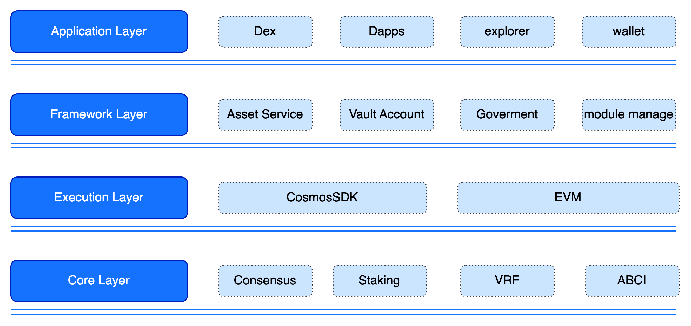

# GateChain Blockchain

Initially, GateChain's mainnet was built on a UTXO-based architecture, implementing its own secure account model and conducting prototype verification. This work has been recognized in the industry and resulted in a research paper titled "Research on Secure Accounts Based on UTXO Model" (pending publication). Subsequently, to better integrate with cross-chain ecosystems, GateChain's architecture migrated to a blockchain framework supported by Tendermint infrastructure. 

At the consensus level, it draws inspiration from Algorand's consensus mechanism, utilizing VRF (Verifiable Random Function) algorithm to enhance security and efficiency. The new architecture directly employs an account model, focusing on upper-layer protocol innovation, with particular emphasis on implementing unique secure accounts featuring revocable transactions and clearing capabilities. 

At the application layer, the new architecture provides standard interfaces to meet the requirements of various upper-layer applications, and offers SDK-based functions for offline account generation and transaction signing, providing convenient development tools for third-party ecosystem applications.

## Mainnet
- Chain ID: 86

## Meteora
- Chain ID: 85