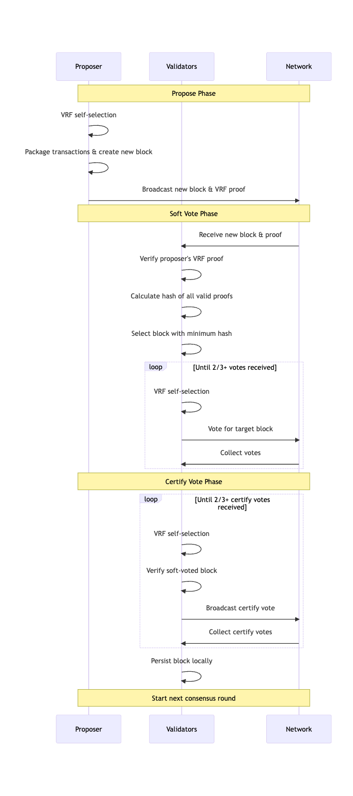

# GateChain Consensus Mechanism

Based on the general POS mechanism, GateChain has made further optimizations to make it easier for users to participate in network consensus, achieve asset appreciation, and decentralized management. Unlike most POS economic models, GateChain focuses on the inclusiveness of asset returns, allowing more users to easily participate in consensus while protecting GateChain's secure and stable operation and obtaining reasonable returns.

## Key Terms

### GateToken (GT)
The native token of GateChain mainnet, used for general value exchange, transaction fee payment, and determining consensus weight.

### Consensus Account (Con-account)
A regular account with non-zero GT balance that becomes a consensus account by initiating a "consensus account online" transaction and paying a fee (equivalent to the regular transfer fee at the time). Consensus accounts are eligible to participate in each round of consensus, with participation depending on the amount of GT held. After consensus begins, consensus accounts perform "self-selection," and if selected, they enter the "committee" for block proposal and validation.

### Consensus Weight (Power)
The weighted calculation of GT held by a consensus account determines its consensus weight. This weight serves as an input parameter for the self-selection algorithm and determines the long-term probability of the account being selected for the committee.

### VRF Selection
Using the VRF (Verifiable Random Function) algorithm for random probability calculation, where the probability of being selected depends on the weighted sum of GT and the total network GT. The long-term probability distribution corresponds to the proportion of GT held by the consensus account relative to the entire network.

### Committee
Consensus accounts that pass the VRF selection enter the committee for the current consensus round. The committee is responsible for proposal, validation, and voting in this round. Committee members have a chance to receive block rewards and transaction fees.

### Committee Leader
In each consensus round, three consensus accounts are selected from the committee with equal probability to become Leaders. Leaders receive the block rewards for that round.

## Gatemint Consensus Process

### 1. Propose
1. All consensus accounts (con-accounts) begin VRF selection
2. Selected accounts organize transactions from the tx pool and package them into a new block
3. The new block and VRF proof are broadcast to all nodes

### 2. Soft Vote
1. Each node receives n newly proposed blocks + proofs
2. First verifies if the proposing node was truly selected (using VRF algorithm verification with the proposing node's pub key and proof)
3. After verification, calculates hash for all verified proofs, with the smallest result becoming the target block for this round
4. All accounts perform self-selection, selected accounts vote on the calculated block and broadcast vote information
5. All nodes collect voting information, round ends when votes exceed 2/3, proceeding to next step

### 3. Certify Vote
1. Each account performs self-selection
2. Selected accounts begin validating the soft vote selected block for issues like double-spending
3. After validation, they vote and broadcast
4. All nodes collect votes for this round, persisting the block to local storage when exceeding 2/3
5. Current block consensus ends, next round begins

