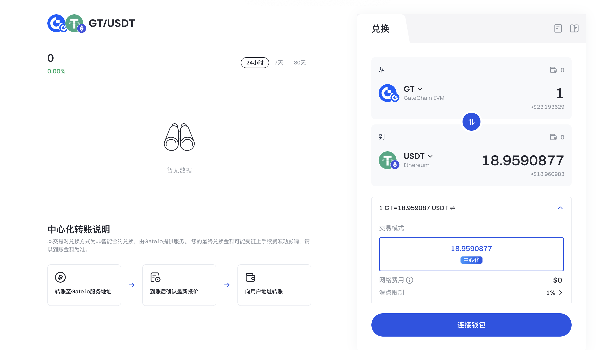
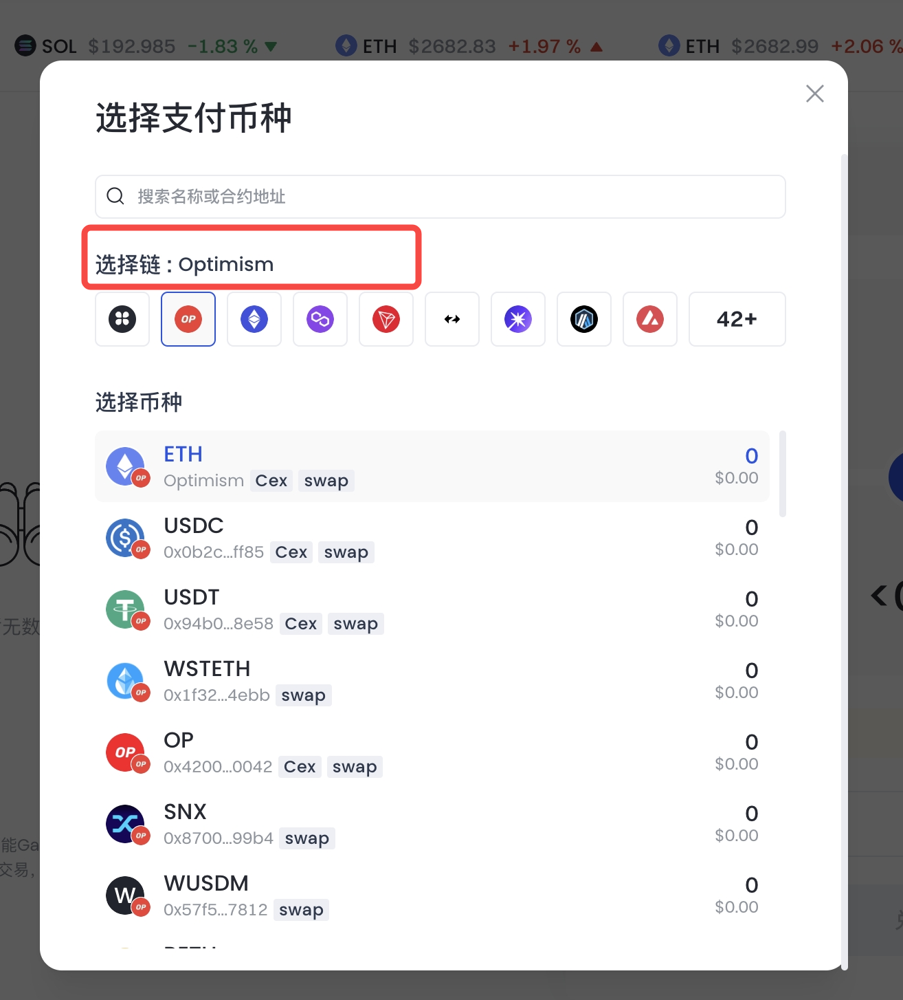

## Introduction to Functionalities 

GateBridge provides a cross-chain protocol based on liquidity pool, which redefines the concept of liquidity pool in a more broad sense, with brand new market marking model and unique order book pattern. 
  
## Function Modules

GateBridge is designed a four-layer cross-chain structure:
  
  

  
  

  
   1. Network: GateBridge supports almost all smart chains in the market based on EVM, ensures fast and secure assts transfers between all supported chains. 
   2. Market Liquidity: GateBridge defines the liquidity pool in a broad sense, bringing in Cross-Chain Automated Market Maker role within the cross-chain transfer or swap. 
   3. Settlement:  Transactions are settled via smart contracts with the authorisation and signature performed using the private keys, which help to achieve safe, fast and low-cost cross-chain transfers and settlements on a three-layer ledger model. 
   4. Application: GateBrige provides an easy-to-use and intuitive interface to facilitate a better user experience. 

## Core Modules

### System Roles

1. User: Who use GateBridge to transfer asset cross-chain.
2. Relayer:  A relayer comprises of multiple nodes, responsible for data transition from one chain to another.  
3.  Liquidity Pool: A series of smart contracts deployed on every smart chain, responsible for asset exchange between chains.
4. Ledger: A series of smart contracts deployed on every smart chain, responsible for maintaining the ledger and security of the entire system.
5. Liquidity Provider:
	1. AMMs from different chains and tokens;
  	2. LPs that provides liquidity for the cross-chain liquidity pool.
      
### Ledger Model

1. User Tx Ledger: The ledger for user transactions, which records the user’s operation related to the liquidity pool. User ledger is implemented using smart contracts deployed on smart chains. 
2. System Ledger: The ledger of the entire cross-chain system, which is a smart contract deployed on the GateChain mainnet, ensuring safety at a minimal maintenance cost.  
3. Result Ledger: Tx execution result on System Ledger will be sent to every smart chains and execute, the result will be recorded in the LP Ledger, which are deployed on every smart chains.

### Pricing Model

In a cross-chain transfer, the assets exchanged are generally same taken, so a fixed 1:1 price will fits this definition better. Assuming two assets: X and Y, sale dx of X would get dy of Y, at this time $dx = $dy. This can be described as a linear invariant arbitrary amount of asset X, the Constant Sum model:

 $\sum x_i=D$ 

The asset price in this model can be determined as $dx_i / $dx_j; assuming $dx_i = $dx_j, the price would always be 1, which means all tokens in the pool have the same price. However, this model is unlikely to fit into an exchange market where the assets should be auto-adjustable, one asset reserve in the pair will easily to be drained and the cross-chain transfer would fail. Many well known decentralised exchanges, like Uniswap, or Balancer, are using a Constant Product model instead to allow price volatility according to market conditions. The formula is as below:

 $x * y=D$ 

The formula can be expanded to a liquidity pool with tokens at any allocation and amount; such as model used in Balancer:

$\prod x_i^{w_i}=D$

But when model is used to tokens of stable price, it will incur huge slippage. So we look into the pricing model of stableswap, or Hybrid Constant Sum and Constant Product instead,  which resembles a constant sum curve when the two tokens reach balance, and a constant product curve when the balance is broken. The slippage in this model looks like a pan, almost zero slippage at the flat bottom, and large slippage as data falling outside of the flat area. See figure below:

  

  
The formula of the StableSwap model;
 

 $An^n\sum x_i + D = ADn^n + \frac{D^{n+1}}{n^n\prod x_i}$
 

For an asset portfolio $\{x_i\}$, we get a $D$; when the assets are exchanged in the pool, the left and right sides of the equal sign should equal to each other; this is how the StableSwap calculate the price. In this model, when there is an imbalance in asset allocation, it creates arbitrage opportunity, which will soon be taken by the arbitrageur and thus bring the balance in asset allocation back. However, this mode has its downsides too:

1. For small value pool, adding or removing liquidity can easily incur excessive slippage outside of the flat bottom area, causing significant slippage loss.
2. For asset that has imbalanced popularities in some chains, the asset amount formats in a pool is likely unfairly allocated, thus causing a drastic price deviation in pools.

To solve these issues, we have improved the Stableswap model:

1. When the assets value in a pool under threshold, Constant Sum model is use; Hybrid Constant Sum and Constant Product model is used only when a pre-set threshold is reached. 
2. When the assets allocation is drastically imbalanced in a pool, the price is limited with upper and lower limits, to ensure a manageable slippage for liquidity provider. When the balance is restored again with arbitragers joining in later, the price will resume.
3. When adding liquidity to one side, which enlarge slippage outside the flat bottom area, an extra fee will be charged to offset the slippage loss of LPs in the pool.

### Cross-Chain Transfer Process

  

  
  

  
#### Add Liquidity Example：

1. Liquidity Provider Alice wanted to add 100 BTC into the pool on Etheruem. On GateBridge interface, Alice selected Add Liquidity, and then deposite 100 BTC. The User Ledger will add a record that Alice added 100 BTC in the liquidity pool was added.
2. Every Relayer monitored that Alice added 100 BTC to the liquidity pool, it would pack this message and other user events, send to System Ledger in GateChain.
3. System Ledger will receive the package from relayers, then verify if the package was approved by a certain number of relayers (POA); if yes, then the transactions in the package would be sent to related liquidity pools for computing, BTC pool in this case. 
4. When the liquidity pool finishes computing, the result would be recorded on System Ledger.
5. Relayers detect execution results on the System Ledger, they would pack the computing result and send to certain chain to execute them. Etheruem in this case.
6. Result Ledger on Ethereum had received the results from the relayer, it would check the execute result, if succeed, then sent 100 BTC worth LP tokens to Alice; otherwise sent 100 BTC back to Alice. 
7. The process of removing liquidity is quite similar.

#### User Cross-Chain Example:

1. Bob wanted to send 10 BTC to BSC from Ethereum, so Bob selected a Cross-Chain Swap on the GateBridge interface, and input 10 BTC. When the operation was successfully done, a record of sending 10 BTC from Ethereum to BSC would be recorded on the User Ledger.
2. Relayers monitor Bob's operation, and all relayers would packed this and other user events, send in pack to the System Ledger on GateChain.
3. After receiving transactions package from different relayers, the System Ledger verify to see if the package was approved by a certain number of relayers; if yes, then the transactions would be sent to liquidity pools for computing, BTC liquidity pool in this case.
4. After the liquidity pool completed calculation, the result would be recorded on the System Ledger.  
5. When the relayer monitored results of System Ledger, they would pack results and send to object chain for execution: if the result was a success, then the calculation result would be packed and sent to BSC; if failure(the main reason of failure was insufficient liquidity on the BSC, resulting insufficient funds to withdraw 10 BTC), the calculation result would be sent back to the Ethereum. 
6. If Result Ledger on the BSC received results from the Relayer, then the execution was a success; the 10 BTC less liquidity fee would be sent to Bob；if Result Ledger of the Ethereum received the result, then the execution was a failure, 10 BTC would be returned to Bob.

## Bridging  to  Gatechain

  1. Goto [GateBridge](https://www.gate.io/zh/web3/swap/gt-bnb?input_chain=86&input_token=GT&output_chain=56&output_token=BNB)
  

  2. Select the Source Chain - indicate the blockchain where your asset currently resides.

  3. Choose Your Asset: Decide which asset you wish to bridge to the  gatechain. A smaller subsection of more liquid assets are included here, such as stablecoins. Always verify that the token you are bridging is correct.  
  

  	  	