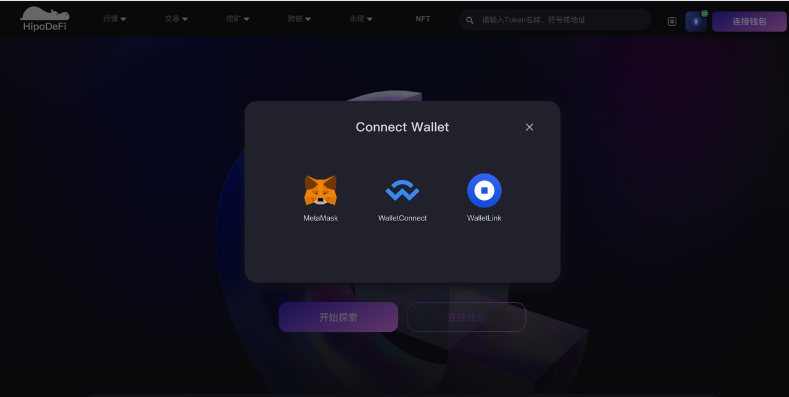
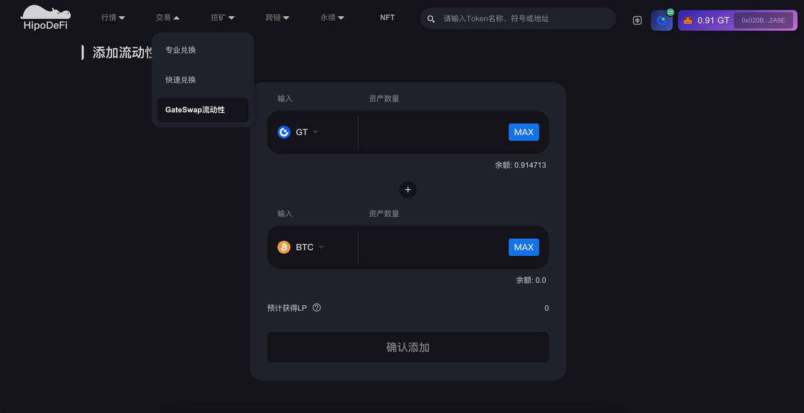
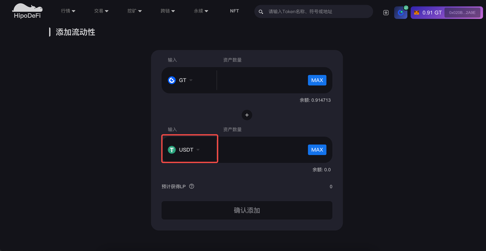
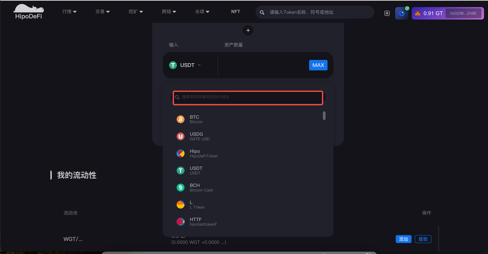
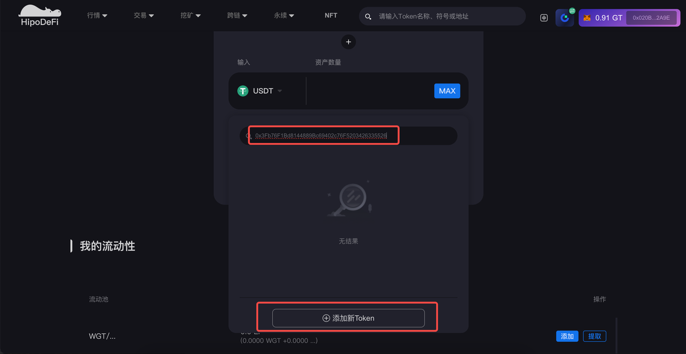
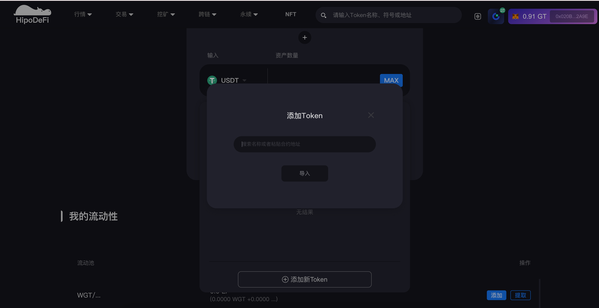
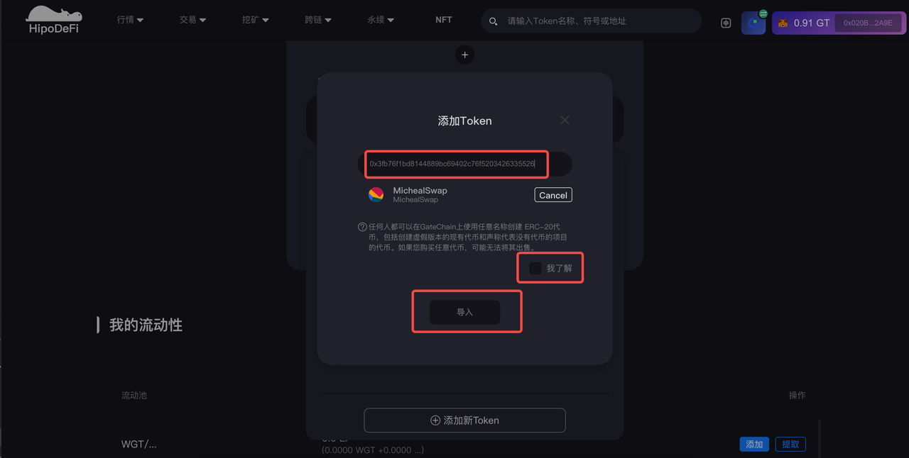
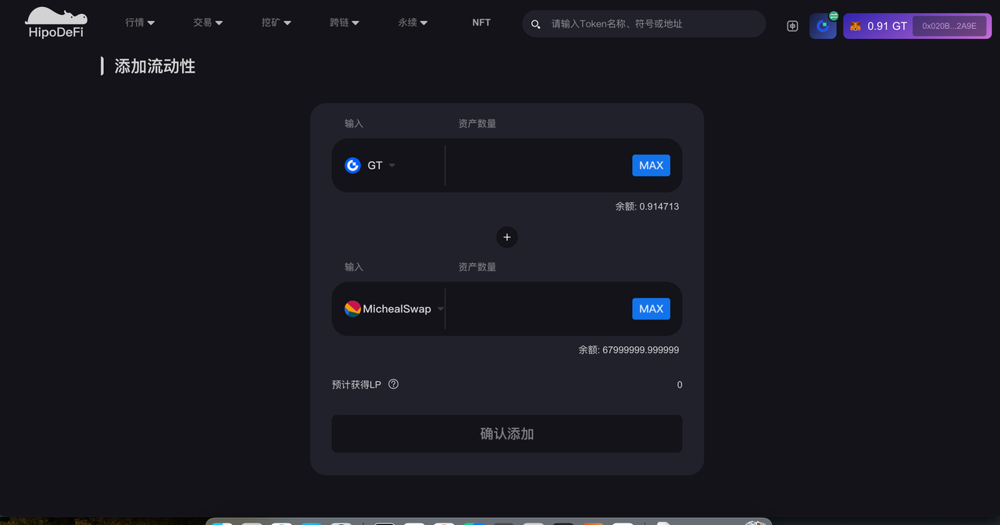
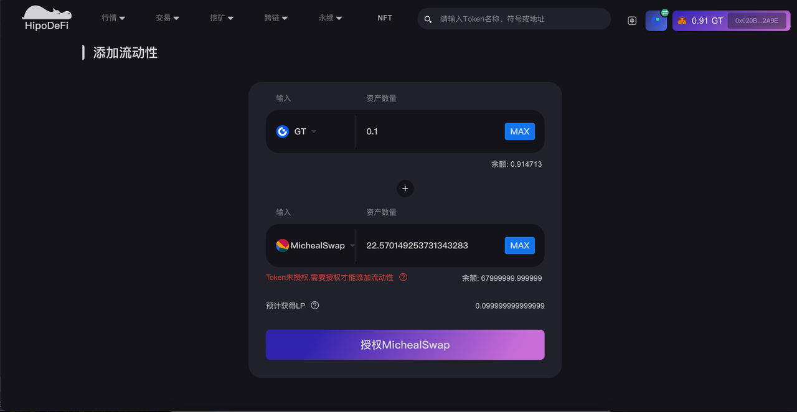
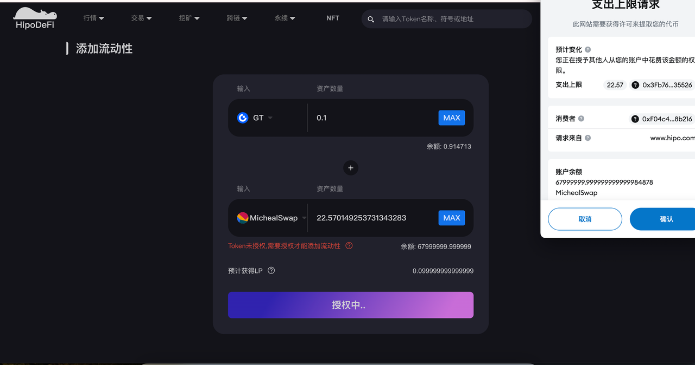

# GateSwap Liquidity Protocol Guide

## Overview

GateSwap is an automated liquidity protocol where each GateSwap smart contract (or pair contract) manages a liquidity pool made up of reserves of two ERC20 tokens.

Anyone can become a liquidity provider (LP) by depositing an equivalent value of each underlying token in exchange for pool tokens. These tokens track pro-rata LP shares of the total reserves and can be redeemed for the underlying assets at any time.

## Main Features

### 1. Add Liquidity

#### Prerequisites
1. Visit [Hipo website](https://www.hipo.com/zh/)
2. Ensure your wallet is connected to GateChain network
3. Connect your wallet

#### Steps to Add Liquidity
1. Enter the "Liquidity Pool" module

2. Switch network (if needed)
   

3. Connect wallet

4. Enter GateSwap Liquidity page

5. Select tokens
   - Click "Input USDT" to select a token
   - Or input an ERC20 contract address (example: `0x3fb76f1bd8144889bc69402c76f5203426335526`)

6. Authorization and confirmation
   - First-time users need wallet authorization
   - Click "Authorize" button and confirm in your wallet
   
    
   - After authorization, click "Confirm Add" and confirm the addition

7. Check your added liquidity in the "My Liquidity" module
   
   

### 2. Remove Liquidity

#### Removal Steps
1. Click "Remove" in the "My Liquidity" module
   

2. First-time removal requires authorization
   

3. Select removal percentage
   - Set the percentage you want to remove
   - Click "Authorize" for approval
   

4. Confirm removal
   - Click "Remove" button
   - Confirm the operation in your wallet
   

### 3. Quick Swap

#### Swap Steps
1. Enter the trading module
   

2. Prerequisites
   - Ensure you're on GateChain network
   - Select tokens for swap
   - First-time swap requires authorization

3. Execute swap
   - Click "Swap" to enter quick swap page
   - Confirm swap information
   - Click "Confirm" and confirm in your wallet
   

4. Check your wallet balance changes after completion
