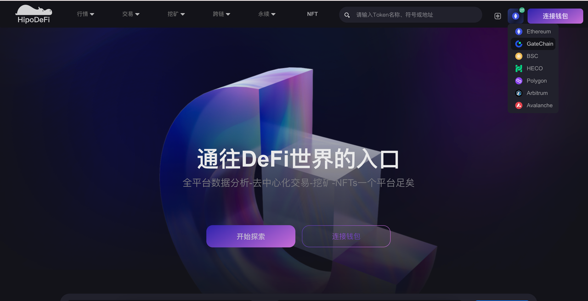

# Introduction

GateSwap is an automated liquidity protocol where each GateSwap smart contract (or pair contract) manages a liquidity pool made up of reserves of two ERC20 tokens.

Anyone can become a liquidity provider (LP) for a pool by depositing an equivalent value of each underlying token in exchange for pool tokens. These tokens track pro-rata LP shares of the total reserves and can be redeemed for the underlying assets at any time.

# Usage

## Add Liquidity

1. Visit the [Hipo website](https://www.hipo.com/zh/) and click on the "Liquidity Pool" module.
    

2. If your wallet network is not GateChain, switch your wallet network to GateChain.
   

3. Connect your wallet.
   

4. After successful connection, you'll see the interface.
   

5. Enter the "GateSwap Liquidity" module.
   

6. On the asset amount page, click "Input USDT" and select a token from the list or input an ERC20 contract address to add liquidity.
   For example, import the deployed contract address: `0x3fb76f1bd8144889bc69402c76f5203426335526`
   

7. For first-time token selection, wallet authorization is required before adding liquidity. Click the "Authorize" button and confirm the authorization in your wallet.
   

8. After successful authorization, click "Confirm Add" and confirm the addition in your wallet.

9. After successful addition, check your wallet token balance changes. The liquidity addition is now complete!

10. In the liquidity pool page, the "My Liquidity" module shows the account's added pool information, where you can perform "Add" or "Remove" operations.
    

## Remove Liquidity

1. After successfully adding liquidity, click "Remove" in the "My Liquidity" module.
   

2. For first-time liquidity removal, wallet authorization is required.

3. Select the percentage you want to remove, then click the "Authorize" button and confirm the authorization in your wallet.
   

4. After successful authorization, click "Remove" and confirm the removal in your wallet.
   

5. After successful removal, check your wallet token balance changes. The liquidity removal is now complete!
   

## Quick Swap

1. Visit the Hipo website and click on the "Trade" module to enter the quick swap page. You can also perform swaps on the professional trading page.
   

2. Select the GateChain network on the page. The system will automatically switch your wallet network to GateChain. In the "Quick Swap" module, select the tokens you want to swap. For first-time token swaps, wallet authorization is required before proceeding with the swap operation. Click the "Authorize" button and confirm the authorization in your wallet.

3. After successful authorization, click "Swap" to enter the quick swap page. Confirm the token swap information, then click "Confirm" and confirm the swap in your wallet.
   

4. After successful swap, check your wallet token balance changes. The quick swap operation is now complete!
