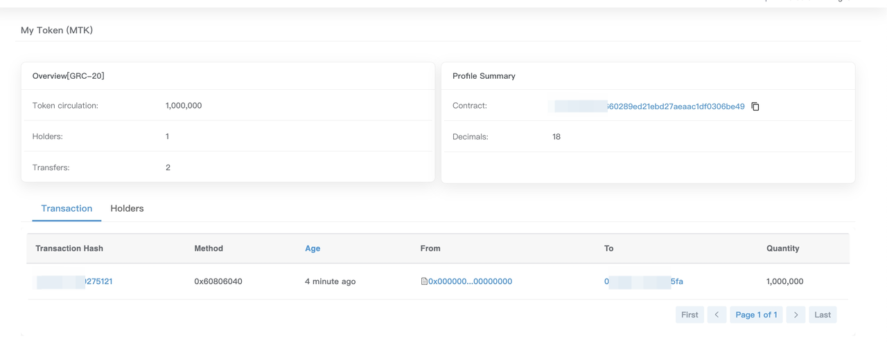

# Creating and Deploying ERC20 Token Using Hardhat

This guide demonstrates how to create an ERC20 contract using Hardhat and deploy it to the GateChain mainnet.

## 1. Creating a Hardhat Project

### 1.1 Create Project Directory
```bash
mkdir hardhat && cd hardhat
```

### 1.2 Initialize Project
Initialize the project to create a package.json file:
```bash
npm init -y
```

### 1.3 Install Hardhat
```bash
npm install hardhat
```

### 1.4 Create Hardhat Project
```bash
npx hardhat init
```

### 1.5 Select Project Type
The system will display a menu allowing you to create a new project or use a template project. In this example, select `Create an empty hardhat.config.js`, which will create a Hardhat configuration file for your project.

## 2. Modify Hardhat Configuration File

### 2.1 Modify hardhat.config.js 

Configuration details:
- Solidity compiler version: 0.8.18
- GateChain mainnet EVM RPC URLs:
  - https://evm.nodeinfo.cc (recommended)
  - https://evm-1.nodeinfo.cc
  - https://evm.gatenode.cc
  - https://evm-hk.gatenode.cc (Hong Kong node)
- chainId: GateChain mainnet chain ID 86
- privateKey: Account used to deploy and interact with smart contracts. Please replace with your private key

```javascript
require("@nomicfoundation/hardhat-toolbox");
require("@nomiclabs/hardhat-web3");

/** @type import('hardhat/config').HardhatUserConfig */

const privateKey = 'INSERT_PRIVATE_KEY';

module.exports = {
  solidity: '0.8.20',
  networks: {
    Mainnet: {
      url: 'https://evm.nodeinfo.cc', 
      chainId: 86, 
      accounts: [privateKey],
      gasPrice: 10000000000, // 10 gwei
    },
  },
};
```

## 3. Write Contract File

### 3.1 Create contracts Directory
```bash
mkdir contracts
```

### 3.2 Create MyToken.sol File
```bash
touch contracts/MyToken.sol
```

### 3.3 Add Contract Content
```solidity
// SPDX-License-Identifier: MIT
pragma solidity ^0.8.20;

import "@openzeppelin/contracts/token/ERC20/ERC20.sol";
import "@openzeppelin/contracts/access/Ownable.sol";

contract MyToken is ERC20, Ownable {
    constructor(string memory name, string memory symbol, uint256 initialSupply) 
        ERC20(name, symbol)
        Ownable(msg.sender)
    {
        _mint(msg.sender, initialSupply * 10 ** decimals());
    }

    function mint(address to, uint256 amount) public onlyOwner {
        _mint(to, amount);
    }
}
```

## 4. Compile Solidity

### 4.1 Install Dependencies
```bash
npm install @nomicfoundation/hardhat-toolbox@^2.0.2 @nomiclabs/hardhat-web3@^2.0.0 @openzeppelin/contracts
```

### 4.2 Compile Contract
You can use Hardhat's built-in compile task. This task will look for Solidity files in the contracts directory and compile them according to the version and settings defined in hardhat.config.js.

Run the following command to compile the contract:
```bash
npx hardhat compile
```


After compilation, an artifacts directory will be created: this contains the contract bytecode and metadata in .json files. You can add this directory to your .gitignore.

If you modify the contract content after compilation, you can recompile the contract using the above command. Hardhat will automatically detect changes and recompile the contract. If there are no updates, no compilation will occur. If needed, you can use the clean task to force recompilation, which will clean the cache files and delete old artifact files.

## 5. Deploy Contract

### 5.1 Create Deployment Script
```bash
mkdir scripts && touch scripts/deploy.js
```

### 5.2 Write Deployment Script
```javascript
const hre = require("hardhat");

async function main() {
  const [deployer] = await ethers.getSigners();
  console.log("Deploying contracts with the account:", deployer.address);

  const tokenName = "My Token";
  const tokenSymbol = "MTK";
  const initialSupply = 1000000; // 1 million tokens

  const MyToken = await hre.ethers.getContractFactory("MyToken");
  const myToken = await MyToken.deploy(tokenName, tokenSymbol, initialSupply);

  await myToken.deployed();

  console.log("Token deployed to:", myToken.address);
  console.log("Token Name:", await myToken.name());
  console.log("Token Symbol:", await myToken.symbol());
  console.log("Total Supply:", await myToken.totalSupply());
}

main().catch((error) => {
  console.error(error);
  process.exitCode = 1;
});
```

### 5.3 Run Deployment Script
```bash
npx hardhat run scripts/deploy.js --network Mainnet
```

